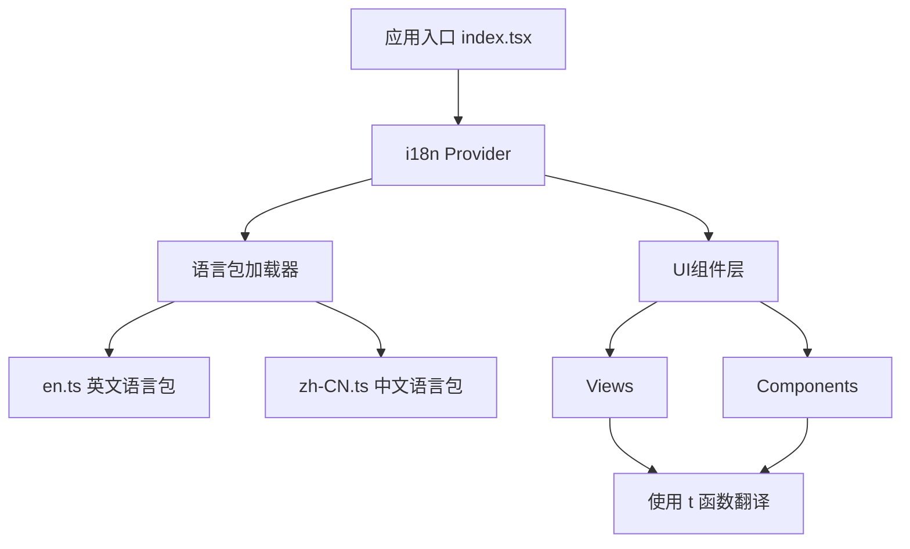

# OpenWork 项目 i18n 国际化实施计划

## 一、项目概况与现状分析

### 1.1 项目基本信息

- **项目名称**: OpenWork
- **项目类型**: Tauri桌面应用
- **前端框架**: SolidJS
- **版本**: 0.1.23
- **主要功能**: 可扩展的开源知识工作者系统，提供工作流自动化、会话管理、模板系统、技能管理等功能

### 1.2 当前i18n状态

✅ **已安装依赖**
- `@solid-primitives/i18n: ^2.2.1` 已在 package.json 中

❌ **待完成工作**
- `src/i18n/locales` 目录为空，无任何语言包
- 项目中未使用任何i18n相关API
- 所有UI文本均为硬编码的英文字符串
- 无i18n配置和初始化代码

### 1.3 需要国际化的模块分析

根据项目结构分析，需要国际化的主要模块包括:

#### 🎯 核心视图 (Views)
1. **DashboardView** - 仪表盘视图 (895行)
   - 导航标签: Sessions, Templates, Skills, Plugins, MCPs, Settings
   - 连接状态、工作空间管理
   - 快速启动模板区域

2. **SessionView** - 会话视图
   - 消息列表、权限请求
   - 工具调用、执行计划
   - 状态提示

3. **OnboardingView** - 引导视图 (271行)
   - 模式选择 (Host/Client)
   - 工作空间创建流程
   - 连接配置界面

4. **SettingsView** - 设置视图 (509行)
   - 连接设置
   - 模型配置
   - 更新管理
   - 高级选项

5. **TemplatesView** - 模板视图
   - 模板列表和管理
   - 创建/编辑模板

6. **SkillsView** - 技能视图
   - 技能列表和安装
   - OpenPackage集成

7. **PluginsView** - 插件视图
   - 插件管理
   - 作用域选择

8. **McpView** - MCP服务器视图
   - MCP服务器连接管理
   - 快速连接和高级配置

#### 🧩 UI组件 (Components)
1. **Button** - 按钮组件
2. **TextInput** - 文本输入
3. **WorkspacePicker** - 工作空间选择器
4. **WorkspaceChip** - 工作空间标签
5. **TemplateModal** - 模板弹窗
6. **ModelPickerModal** - 模型选择弹窗
7. **CreateWorkspaceModal** - 创建工作空间弹窗
8. **ResetModal** - 重置弹窗
9. **McpAuthModal** - MCP认证弹窗
10. **ThinkingBlock** - 思考块显示
11. **Card** - 卡片组件
12. **PartView** - 部分视图
13. **OnboardingWorkspaceSelector** - 引导工作空间选择器

#### 📦 业务逻辑模块
1. **app/constants.ts** - 常量定义
2. **app/utils.ts** - 工具函数(包含时间格式化等)
3. **lib/tauri.ts** - Tauri集成
4. **lib/opencode.ts** - OpenCode SDK集成

---

## 二、技术方案设计

### 2.1 i18n架构



### 2.2 文件组织结构

```
src/
├── i18n/
│   ├── index.ts                 # i18n配置和导出
│   ├── locales/
│   │   ├── en.ts               # 英文语言包
│   │   └── zh-CN.ts            # 中文语言包
│   ├── types.ts                # 类型定义
│   └── utils.ts                # i18n工具函数
├── App.tsx                     # 添加I18nProvider
└── [其他文件保持不变]
```

### 2.3 语言包组织策略

采用 **模块化分组** 策略，按功能模块组织翻译key:

```typescript
// 语言包结构示例
{
  common: {
    buttons: { /* 通用按钮文本 */ },
    actions: { /* 通用操作 */ },
    status: { /* 状态文本 */ }
  },
  onboarding: { /* 引导流程 */ },
  dashboard: { /* 仪表盘 */ },
  session: { /* 会话 */ },
  settings: { /* 设置 */ },
  templates: { /* 模板 */ },
  skills: { /* 技能 */ },
  plugins: { /* 插件 */ },
  mcp: { /* MCP */ },
  errors: { /* 错误信息 */ },
  validation: { /* 验证提示 */ }
}
```

### 2.4 技术选型说明

**选择 `@solid-primitives/i18n` 的原因:**
1. ✅ 已安装在项目中
2. ✅ 专为SolidJS设计，性能优化
3. ✅ 响应式翻译更新
4. ✅ 支持嵌套key和插值
5. ✅ TypeScript类型安全

**核心API使用:**
```typescript
// 创建字典
const dict = {
  en: { greeting: "Hello" },
  "zh-CN": { greeting: "你好" }
};

// 创建翻译函数
const [locale, setLocale] = createSignal("en");
const t = createI18nContext(dict, locale);

// 在组件中使用
<h1>{t("greeting")}</h1>
```

---

## 三、实施步骤详解

### ✅ 阶段 1: i18n基础设施搭建 (第1-2天) - 已完成

#### 步骤 1.1: 创建i18n核心文件 ✅

**已创建文件:**
- ✅ [src/i18n/types.ts](file:///d:/projects/openwork/src/i18n/types.ts) - TypeScript类型定义
- ✅ [src/i18n/utils.ts](file:///d:/projects/openwork/src/i18n/utils.ts) - 工具函数
- ✅ [src/i18n/index.ts](file:///d:/projects/openwork/src/i18n/index.ts) - 配置和导出

**完成内容:**
```typescript
export type Locale = 'en' | 'zh-CN';

export interface LocaleOption {
  code: Locale;
  label: string;
  nativeLabel: string;
}

export type TranslationDict = {
  [key: string]: string | TranslationDict;
};
```

**utils.ts 内容规划:**
```typescript
// 语言检测
export function detectLocale(): Locale { /* ... */ }

// 语言持久化
export function saveLocale(locale: Locale): void { /* ... */ }
export function loadSavedLocale(): Locale | null { /* ... */ }

// 浏览器语言映射
export function getBrowserLocale(): Locale { /* ... */ }
```

**index.ts 内容规划:**
```typescript
import { createI18nContext } from '@solid-primitives/i18n';
import enDict from './locales/en';
import zhCNDict from './locales/zh-CN';

export const dictionaries = {
  en: enDict,
  'zh-CN': zhCNDict
};

export function setupI18n(initialLocale: Locale) {
  // 创建和配置i18n上下文
}
```

#### 步骤 1.2: 创建英文基准语言包 ✅

**文件:** ✅ [src/i18n/locales/en.ts](file:///d:/projects/openwork/src/i18n/locales/en.ts)

**完成内容:**
- ✅ 完整的模块化翻译结构
- ✅ 涵盖通用、引导、仪表盘、设置、模板、技能、插件、MCP等所有核心模块
- ✅ 包含验证和错误消息
- ✅ 类型安全导出

**中文语言包:** ✅ [src/i18n/locales/zh-CN.ts](file:///d:/projects/openwork/src/i18n/locales/zh-CN.ts)
- ✅ 所有英文翻译的完整中文版本
- ✅ 术语统一，表达自然

#### 步骤 1.3: 修改应用入口，集成i18n ✅

**修改文件:** ✅ [src/App.tsx](file:///d:/projects/openwork/src/App.tsx)

**主要更改:**
1. ✅ 导入i18n配置 (`import { I18nProvider } from "./i18n";`)
```typescript
export default {
  common: {
    buttons: {
      save: 'Save',
      cancel: 'Cancel',
      delete: 'Delete',
      edit: 'Edit',
      create: 'Create',
      connect: 'Connect',
      disconnect: 'Disconnect',
      // ... 更多通用按钮
    },
    status: {
      connected: 'Connected',
      disconnected: 'Disconnected',
      loading: 'Loading...',
      error: 'Error',
      // ... 更多状态
    }
  },
  // ... 其他模块
} as const;

export type Translations = typeof import('./en').default;
```

#### 步骤 1.3: 修改应用入口，集成i18n

**修改文件:** [src/App.tsx](file:///d:/projects/openwork/src/App.tsx)

**主要更改:**
1. 导入i18n配置
2. 创建locale signal
3. 包裹I18nProvider
4. 提供语言切换功能

```typescript
import { createSignal } from 'solid-js';
import { I18nProvider } from '@solid-primitives/i18n';
import { setupI18n, loadSavedLocale } from './i18n';

function App() {
  const [locale, setLocale] = createSignal(loadSavedLocale() || 'en');
  const i18n = setupI18n(locale);

  return (
    <I18nProvider value={i18n}>
      {/* 现有应用内容 */}
    </I18nProvider>
  );
}
```

---

### 阶段 2: 提取和翻译UI文本 (第3-7天)

#### ✅ 步骤 2.1: 文本提取策略 - 已完成

**提取优先级:**
1. 🔴 高优先级 - 用户可见的静态文本
   - 按钮标签
   - 标题和描述
   - 表单标签
   - 错误消息
   
2. 🟡 中优先级 - 动态生成的文本
   - 状态提示
   - 时间格式化
   - 数字格式化
   
3. 🟢 低优先级 - 开发者相关
   - 控制台日志
   - 调试信息

**提取工具和流程:**
1. 使用正则表达式搜索模式识别硬编码字符串
2. 为每个字符串创建翻译key
3. 记录字符串位置和上下文
4. 生成翻译清单

#### 步骤 2.2: 按模块提取和替换

##### ✅ 2.2.1 OnboardingView 国际化 - 已完成

**文件:** [src/views/OnboardingView.tsx](file:///d:/projects/openwork/src/views/OnboardingView.tsx)

**完成内容:**
- ✅ 添加 `useI18n` hook 导入
- ✅ 在组件中初始化 `const { t } = useI18n()`
- ✅ 模式选择页面文本国际化
- ✅ 工作空间创建页面文本国际化
- ✅ 客户端连接页面文本国际化
- ✅ 连接中状态页面文本国际化
- ✅ 引擎状态相关文本国际化
- ✅ 新增 `onboarding.engine` 翻译 key 组

**提取文本清单:**
```typescript
// en.ts
onboarding: {
  mode: {
    title: 'How would you like to run OpenWork today?',
    host: {
      title: 'Run on this computer',
      description: 'OpenWork runs OpenCode locally and keeps your work private.'
    },
    client: {
      title: 'Connect as a Client (Remote Pairing)',
      // ...
    }
  },
  workspace: {
    createFirst: 'Create your first workspace',
    create: 'Create a workspace',
    chooseFolder: 'Choose a folder and preset to set up your workspace.',
    // ...
  },
  // ...
}
```

**使用示例:**
```typescript
import { useI18n } from '../i18n';

export default function OnboardingView(props) {
  const { t } = useI18n();
  
  return (
    <h2>{t('onboarding.mode.subtitle')}</h2>
    // ...
  );
}
```

##### ✅ 2.2.2 DashboardView 国际化 - 已完成

**文件:** [src/views/DashboardView.tsx](file:///d:/projects/openwork/src/views/DashboardView.tsx)

**关键翻译点:**
- ✅ 导航标签 (Sessions, Templates, Skills等)
- ✅ "What should we do today?"
- ✅ "New Task" 按钮
- ✅ 连接状态显示
- ✅ 快速启动模板区域
- ✅ 最近会话列表及时间格式化
- ✅ 移动端导航菜单

##### ✅ 2.2.3 SettingsView 国际化 - 已完成

**文件:** [src/views/SettingsView.tsx](file:///d:/projects/openwork/src/views/SettingsView.tsx)

**关键翻译点:**
- 各设置项标题和描述
- 更新状态文本
- 按钮标签
- 提示信息

##### 2.2.4 其他视图国际化

按相同模式处理:
- SessionView
- ✅ TemplatesView
- ✅ SkillsView
- ✅ PluginsView
- ✅ McpView

#### 步骤 2.3: 组件国际化

**组件翻译策略:**
- 模态框: 标题、描述、按钮
- 表单: 标签、占位符、验证消息
- 通知: 成功/错误/警告消息

**执行进度:**
- ✅ WorkspacePicker: 已完成
- ✅ CreateWorkspaceModal: 已完成

#### 步骤 2.4: 创建中文翻译

**文件:** [src/i18n/locales/zh-CN.ts](file:///d:/projects/openwork/src/i18n/locales/zh-CN.ts)

**翻译质量标准:**
1. ✅ 符合中文表达习惯
2. ✅ 技术术语准确
3. ✅ 保持UI简洁
4. ✅ 语气一致性

**关键术语对照表:**

| English | 中文 | 说明 |
|---------|------|------|
| Workspace | 工作空间 | |
| Session | 会话 | |
| Template | 模板 | |
| Skill | 技能 | |
| Plugin | 插件 | |
| Host Mode | 本地模式 | |
| Client Mode | 客户端模式 | |
| MCP Server | MCP服务器 | 保留英文缩写 |
| Onboarding | 引导 | |
| Dashboard | 仪表盘 / 控制台 | |

---

### 阶段 3: 实用功能增强 (第8-9天)

#### 步骤 3.1: 语言切换UI

**在SettingsView添加语言选择:**

```typescript
// settings语言包
settings: {
  language: {
    title: 'Language',
    description: 'Choose your preferred language',
    options: {
      en: 'English',
      zhCN: '简体中文'
    }
  }
}
```

**UI实现:**
- 下拉选择框或切换按钮
- 实时切换，无需重启
- 保存用户选择到localStorage

#### 步骤 3.2: 时间格式化国际化

**修改文件:** [src/app/utils.ts](file:///d:/projects/openwork/src/app/utils.ts)

**formatRelativeTime 函数增强:**
```typescript
export function formatRelativeTime(timestamp: number, locale: Locale = 'en'): string {
  // 支持中英文相对时间
  // en: "2 hours ago"
  // zh-CN: "2小时前"
}
```

#### 步骤 3.3: 数字和日期格式化

使用 `Intl` API:
```typescript
// 日期格式化
new Intl.DateTimeFormat(locale, options).format(date);

// 数字格式化
new Intl.NumberFormat(locale).format(number);

// 文件大小格式化
formatBytes(size, locale);
```

---

### 阶段 4: 测试与验证 (第10-11天)

#### 步骤 4.1: 功能测试

**测试清单:**

- [ ] 语言切换功能正常
- [ ] 所有视图文本正确显示
- [ ] 动态文本正确翻译
- [ ] 表单验证消息本地化
- [ ] 错误提示本地化
- [ ] 时间/日期/数字格式化正确
- [ ] 语言选择持久化
- [ ] 默认语言检测正确

#### 步骤 4.2: UI测试

**检查项:**
- [ ] 中文文本不会导致布局破坏
- [ ] 长文本有适当的省略或换行
- [ ] 按钮文本长度适配
- [ ] 模态框标题和内容对齐
- [ ] 响应式布局兼容

#### 步骤 4.3: 翻译质量审查

**审查维度:**
1. 准确性 - 翻译是否准确
2. 一致性 - 术语使用是否统一
3. 流畅性 - 表达是否自然
4. 完整性 - 是否有遗漏

#### 步骤 4.4: 边缘情况测试

- 切换语言时正在进行的操作
- 缺少翻译key的降级处理
- 浏览器语言设置和应用语言的优先级

---

### 阶段 5: 文档和优化 (第12天)

#### 步骤 5.1: 开发文档

**创建文档:** `docs/i18n-guide.md`

**内容包括:**
1. i18n系统概述
2. 如何添加新翻译
3. 如何添加新语言
4. 翻译key命名规范
5. 常见问题解答

#### 步骤 5.2: 代码注释和类型完善

- 为i18n相关函数添加JSDoc注释
- 完善TypeScript类型定义
- 确保类型安全

#### 步骤 5.3: 性能优化

- 懒加载语言包(如果包较大)
- 缓存翻译结果
- 减少重复计算

#### 步骤 5.4: CI/CD集成(可选)

- 翻译覆盖率检查
- 未使用的key检测
- 翻译文件格式验证

---

## 四、验收标准

### 4.1 功能验收

- ✅ 支持英文(en)和简体中文(zh-CN)双语
- ✅ 用户可在设置中切换语言
- ✅ 语言选择可持久化保存
- ✅ 首次启动时根据系统语言自动选择
- ✅ 所有UI文本均已国际化
- ✅ 时间、日期、数字格式化支持本地化

### 4.2 代码质量

- ✅ 无硬编码的UI文本(开发日志除外)
- ✅ 翻译key命名规范统一
- ✅ TypeScript类型完整
- ✅ 代码有适当注释

### 4.3 用户体验

- ✅ 语言切换实时生效
- ✅ 中文UI布局美观
- ✅ 翻译准确流畅
- ✅ 无明显性能问题

### 4.4 可维护性

- ✅ 文档完整
- ✅ 易于添加新语言
- ✅ 易于添加新翻译

---

## 五、风险评估与应对

### 5.1 潜在风险

| 风险 | 影响 | 概率 | 应对策略 |
|------|------|------|----------|
| 翻译遗漏 | 中 | 中 | 建立翻译清单，逐一核对 |
| 布局破坏 | 高 | 低 | UI测试，使用flex布局 |
| 性能下降 | 低 | 低 | 性能监控，优化加载 |
| 术语不统一 | 中 | 中 | 建立术语表，翻译审查 |

### 5.2 回滚计划

如遇重大问题，可通过以下方式回滚:
1. 默认语言保持为英文
2. i18n Provider可选性包装
3. 保留原始英文字符串作为fallback

---

## 六、时间规划

### 6.1 总体时间线

| 阶段 | 天数 | 累计 |
|------|------|------|
| 基础设施搭建 | 2天 | 2天 |
| 文本提取翻译 | 5天 | 7天 |
| 功能增强 | 2天 | 9天 |
| 测试验证 | 2天 | 11天 |
| 文档优化 | 1天 | 12天 |

**总计: 12个工作日**

### 6.2 里程碑

- **D2**: i18n基础设施可用
- **D4**: OnboardingView + DashboardView 完成
- **D7**: 所有视图和组件完成
- **D9**: 增强功能完成
- **D11**: 测试通过
- **D12**: 文档完成，项目交付

---

## 七、后续扩展建议

### 7.1 短期扩展

1. **添加更多语言**
   - 繁体中文 (zh-TW)
   - 日语 (ja)
   - 韩语 (ko)

2. **翻译管理工具集成**
   - Crowdin
   - Lokalise
   - i18n-ally VSCode插件

### 7.2 长期扩展

1. **内容本地化**
   - 文档本地化
   - 帮助内容本地化
   - 错误消息详细化

2. **区域特性支持**
   - 货币格式
   - 时区处理
   - RTL语言支持(阿拉伯语等)

3. **AI辅助翻译**
   - 自动翻译建议
   - 翻译质量检查
   - 术语一致性分析

---

## 附录

### A. 参考资料

1. [@solid-primitives/i18n 文档](https://github.com/solidjs-community/solid-primitives/tree/main/packages/i18n)
2. [SolidJS 官方文档](https://www.solidjs.com/)
3. [i18n 最佳实践](https://phrase.com/blog/posts/i18n-best-practices/)

### B. 工具推荐

1. **开发工具**
   - i18n-ally - VSCode扩展，可视化翻译管理
   - react-i18next-parser - 自动提取翻译key

2. **测试工具**
   - Pseudolocalization - 测试文本扩展
   - i18n-coverage - 翻译覆盖率检查

### C. 联系方式

如有问题，请联系:
- 项目负责人: [待定]
- 技术支持: [待定]

---

**文档版本**: v1.0  
**创建日期**: 2026-01-20  
**最后更新**: 2026-01-20  
**状态**: 待审核
